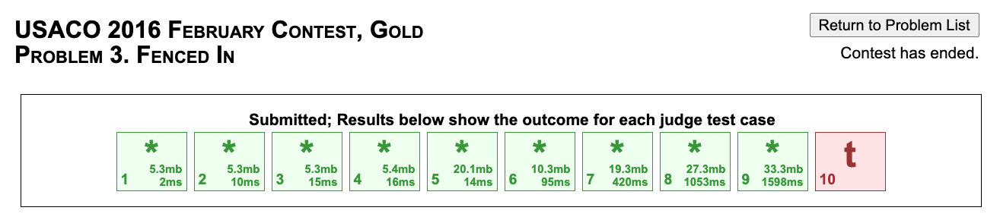
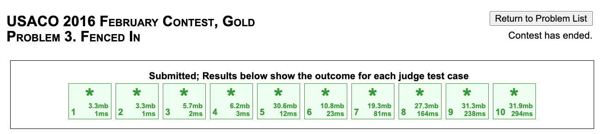
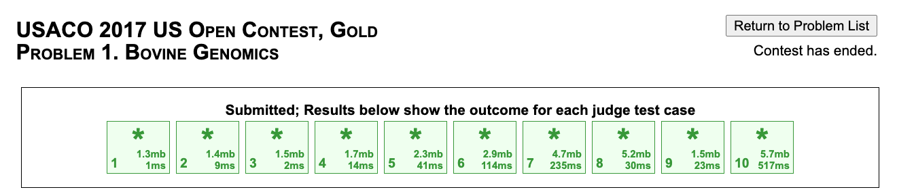
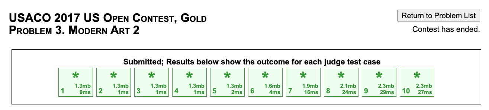

# November 2020 USACO Gold Marathon

Starting Thursday, November 12th, I want to solve (or re-solve) every USACO Gold problem from December 2015 onwards. This is in preparation for the upcoming USACO contest season, which will start in December.

## Thursday, November 12th
Start Time: 4:45pm

| Contest  | Time Solved | ID        | Name                      | Method          |
| -------- | ----------- | --------- | ------------------------- | --------------- |
| Dec 2015 | 5:07pm      | cardgame  | High Card Low Card (Gold) | Greedy          |
| Dec 2015 | 5:14pm      | feast     | Fruit Feast               | Knapsack DP     |
| Dec 2015 | 5:41pm      | dream     | Bessie's Dream            | BFS with 4-D states|
| Jan 2016 | 6:32pm      | angry     | Angry Cows                | Precompute prefix/suffix, binary search on answer with sliding window             |
| Jan 2016 | 6:53pm      | radio     | Radio Contact             | Precompute positions, DP\[fj]\[bessie] |
| Jan 2016 | 7:51pm      | lightsout | Lights Out                | Wrote an N2 log N2 with hashing, distance precomp Had to look up the ccw function N <= 200 so I didn't have to do N2 log N2 but I did anyways

Stopped because of Chemistry H Unit 2 Test tomorrow

## Sunday, November 15th
Start Time: 7:30pm

| Contest  | Time Solved | ID      | Name                    | Method               |
| -------- | ----------- | ------- | ----------------------- | -------------------- |
| Feb 2016 | 7:44pm      | cbarn   | Circular Barn           | Greedy Simulation    |
| Feb 2016 | 8:15pm      | cbarn2  | Circular Barn Revisited | DP\[door]\[i]\[prev] | 
| Feb 2016 | Unfinished (Stopped at 10:17pm, got 9/10) | fencedin | Fenced In | MST |

Need to go finish an essay organizer for an essay on Lord of the Flies

## Monday, November 16th - Wednesday, November 18th
I spent a couple hours trying to constant optimize my Prim's solution.
I changed my solution to use bitshifts to store the items, and used the `push_heap` and `pop_heap` STL functions instead of a `priority_queue` to save on the overhead of container expansion.
I wasn't able to get the last test case.

In the end I read the editorial and used Kruskal.
The editorial's code makes use of the neat observation that the cost of the edges separating any one row or column will always be the same, so we don't actually need to store and then sort all of the edges.
Instead we just sort the horizontal difference array and the vertical difference array, and then go through both of those.
I glanced at the Plat version's editorial as well, and it seems to be key to the Plat solutions.
Of course, the editorial's text decided to not mention this observation at all.
I had to spend 30 minutes reading the editorial code and drawing things to figure out what it was doing.

My final solution was based on the editorial's code and so they look very similar.

## Thursday, November 19th
Start Time: 6:50pm 
Read Open 2016 editorials from 7:51-7:58 
Dinner + talking w/ family until 9pm 

| Contest   | Time Solved | ID        | Name                | Method                  |
| --------- | ----------- | --------- | ------------------- | ----------------------- |
| Open 2016 | 7:12pm      | split     | Splitting the Field | Sweepline               |
| Open 2016 | 7:26pm      | closing   | Closing the Farm    | Reverse input, DSU      |
| Open 2016 | 7:51pm      | 248       | 248                 | Interval DP             |
| Dec 2016  | 9:17pm      | moocast   | Moocast             | Euclidean MST w/ Prim   |
| Dec 2016  | 9:37pm      | checklist | Cow Checklist       | DP\[h]\[g]\[prev]       |
| Dec 2016  | 10:52pm     | lasers    | Lasers and Mirrors  | Model as graph, 0-1 BFS |

## Sunday, November 22nd
Start Time: 7:00pm 
Pause to eat dinner: 8:06pm -  8:34pm 

| Contest   | Time Solved | ID        | Name                | Method                  |
| --------- | ----------- | --------- | ------------------- | ----------------------- |
| Jan 2017  | 7:10pm      | bphoto    | Balanced Photo      | BIT                     |
| Jan 2017  | 7:19pm      | hps       | Hoof, Paper, Scissors | DP\[game]\[changes]\[cur] |
| Jan 2017  | 8:02pm      | cownav    | Cow Navigation      | BFS with lots of state info |
| Feb 2017  | 8:53pm      | visitfj   | WDTCCTR             | Dijkstra                |
| Feb 2017  | 9:02pm      | nocross   | WDTCCTR II          | DP\[left]\[right\       |
| Feb 2017  | 9:32pm      | circlecross | WDTCCTR III       | BIT                     |
| Open 2017 | 10:56pm (unfinished) | cownomics | Bovine Genomics | String hash + binsearch |     

## Monday, November 23rd
Solved Bovine Genomics by fixing the substring hash calculation 
N and M were also swapped when fixing the left endpoint of the position search, so I fixed that too. 
It doesn't seem like there were any anti-hash hacks so I changed `MCT` to 1 and only used 1e9 + 7. 
I could probably make this a bit faster by removing the creation of arrays but it passes comfortably already so I won't bother. 

## Wednesday, November 25th
Started solving Modern Art 2 around 9:15pm 
Finished at 9:37pm 

Recap of Open 2017: 
| Contest   | Time Solved | ID        | Name                | Method                  |
| --------- | ----------- | --------- | ------------------- | ----------------------- |
| Open 2017 |             | cownomics | Bovine Genomics     | String hash + binsearch |
| Open 2017 | 9:37pm      | art2      | Modern Art 2        | Observation + stack     |

## Thursday, November 26th
Start Time: 5:10pm
Thanksgiving Dinner w/ family: 6:00pm - 7:55pm

| Contest   | Time Solved | ID        | Name                | Method                  |
| --------- | ----------- | --------- | ------------------- | ----------------------- |
| Dec 2017  | 5:56pm      | piepie    | A Pie for a Pie     | BFS with sketchy unvisited set |
| Dec 2017  | 8:29pm      | barnpainting | Barn Painting    | DP on tree              |
| Dec 2017  | 8:36pm      | hayfeast  | Haybale Feast       | Two pointers            |
| Jan 2018  | 8:57pm      | mootube   | MooTube             | Offine queries w/ DSU   |
| Jan 2018  | 9:17pm      | atlarge   | Cow At Large        | DFS and dist in tree    |
| Jan 2018  | 10:20pm     | spainting | Stamp Painting      | DP + psum + combo + bpow |

## Friday, November 27th
Start Time: 4:50pm

| Contest   | Time Solved | ID        | Name                | Method                  |
| --------- | ----------- | --------- | ------------------- | ----------------------- |
| Feb 2018  | 5:31pm      | snowboots | Snow Boots          | Offine queries w/ DSU   |
| Feb 2018  | 6:03pm      | dirtraverse | Directory Traversal | DP on tree            |
| Feb 2018  | 6:18pm      | taming    | Taming the Herd     | DP\[day]\[breakout]\[val] |
| Open 2018 | 6:58pm      | sort      | Out of Sorts        | Remembering what the editorial said |
| Open 2018 | 7:15pm      | milkorder | Milking Order       | Binsearch + toposort    |
| Open 2018 | 7:47pm      | talent    | Talent Show         | Knapsack on both weight and talent |

## Sunday, November 29th
Start Time: 7:00pm
Doing Cow Land last since I remember this problem being very difficult and I never actually solved it.
My computer crashed around 8:02pm and I lost the recording for the first hour.

| Contest   | Time Solved | ID        | Name                | Method                  |
| --------- | ----------- | --------- | ------------------- | ----------------------- |
| Feb 2019  | 7:27pm      | dishes    | Dishwashing         | Binary search + greedy  |
| Feb 2019  | 8:51pm      | paintbarn | Painting the Barn   | 2D psum + 2D Kadane     |
| Feb 2019  | 9:36pm      | cowland   | Cow Land            | LCA + BIT for update ranges |

## Thursday, December 3rd
Start Time: 5:00pm

This contest was the first Gold contest I participated in.
I got 381 on it by solving walk and getting a few test cases on balance.
I checked my old solution for walk today and I have absolutely no idea how it worked.
It also had an array whose bounds were 750x750 instead of 7500x7500 but fortunately that array wasn't used.
For snakes my old solution got MLE but I didn't realize it because the grader was misconfigured and told me Missing Output File instead.
Also, today for snakes I used a 3d DP with mod 2 trick but there's a way to do it with only 2 states as well.

| Contest   | Time Solved | ID        | Name                | Method                  |
| --------- | ----------- | --------- | ------------------- | ----------------------- |
| Open 2019 | 5:17pm      | snakes    | Snakes              | DP with mod 2 and min   |
| Open 2019 | 6:13pm      | walk      | I Would Walk 500 Miles | MST w/ Prim + removing |
| Open 2019 | 7:10pm      | balance   | Balancing Inversions | Observation + simulation |

## Saturday, December 5th
Start Time: 7:00pm

| Contest   | Time Solved | ID        | Name                | Method                  |
| --------- | ----------- | --------- | ------------------- | ----------------------- |
| Dec 2019  | 7:21pm      | pump      | Milk Pumping        | Try all f\_i, M log N Dijkstra |
| Dec 2019  | 9:28pm      | milkvisits | Milk Visits        | Binlift + sqrt decomp   |
| Dec 2019  | 10:02pm     | cowmbat   | Moortal Cowmbat     | Fld-Wrshl + psum + DP   |

## Tuesday, December 8th
Start Time: 7:15pm

| Contest   | Time Solved | ID        | Name                | Method                  |
| --------- | ----------- | --------- | ------------------- | ----------------------- |
| Jan 2020  | 7:27pm      | time      | Time is Mooney      | DP\[time]\[node]        |
| Jan 2020  | 8:10pm      | threesum  | Farmer John Solves 3SUM | Iterate pairs + bsearch + dp |
| Jan 2020  | 8:45pm      | boards    | Springboards        | Coord comp + sort + dp + BIT |

## Friday, December 11th
Start Time: 6:00pm

Notes before contest:
I made a bad decision and poured a lot of time into Russian AI Cup yesterday.
I remember that this contest was pretty hard (because there was a mathy problem) so I decided to postpone until today so that I could have as much time as possible.

| Contest   | Time Solved | ID        | Name                | Method                  |
| --------- | ----------- | --------- | ------------------- | ----------------------- |
| Feb 2020  | 6:20pm      | timeline  | Timeline            | Toposort                |
| Feb 2020  | 8:01pm      | help      | Help Yourself       | Contribution of individual segment (segment is leftmost in its component) |
| Feb 2020  | 8:48pm      | deleg     | Delegation          | DFS and combine paths, optimize for tree case |

## Saturday, December 12th
Start Time: 7:30pm

Paused for about 12 mins after 9pm to do Advent of Code
| Contest   | Time Solved | ID        | Name                | Method                  |
| --------- | ----------- | --------- | ------------------- | ----------------------- |
| Open 2020 | 7:45pm      | haircut   | Haircut             | BIT to count inversions |
| Open 2020 | 9:22pm      | fcolor    | Favorite Colors     | DSU with sketchy recursive merging |
| Open 2020 | 11:14pm     | exercise  | Exercise            | DP with primes and fanciness |

## Sunday, December 13th
Start Time: 4:50pm

This contest will be more like a virtual contest, since I hopefully haven't seen the problems before.
After contest: I'd seen teamwork before but I don't think I ever solved it.
Also, Cowpatibility passed with 1960ms on TC 10, which is very close.
Trimmed time to 1857ms after the virtual.
| Contest   | Time Solved | ID        | Name                | Method                  |
| --------- | ----------- | --------- | ------------------- | ----------------------- |
| Dec 2018  | 5:08pm      | teamwork  | Teamwork (P3)       | DP with range max       |
| Dec 2018  | 5:41pm      | dining    | Fine Dining (P1)    | Dijkstra with extra state |
| Dec 2018  | 6:34pm      | cowpatibility | Cowpatibility   | PIE over flavor subset counts |

## Thursday, December 17th
Start Time: 5:15pm

This contest should also be more virtual-like since I don't think I've seen any of these before either.
USACO's graders seem to be either very slow or overloaded right now, so it's taking a few minutes to get feedback.
Did some CSES DP while waiting.
| Contest   | Time Solved | ID        | Name                | Method                  |
| --------- | ----------- | --------- | ------------------- | ----------------------- |
| Jan 2019  | Approx 6pm  | poetry    | Cow Poetry          | Knapsack + combo        |
| Jan 2019  | 6:17pm      | shortcut  | Shortcut            | Dijkstra w/ path, try all nodes |
| Jan 2019  | 6:32pm      | sleepy    | Sleepy Cow Sorting  | Find sorted suffix, insert into suffix |

