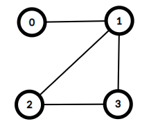

# Connecting Supertrees (supertrees)

Gardens by the Bay is a large nature park in Singapore. In the park there are $n$ towers, known as supertrees. These towers are labelled $0$ to $n-1$. We would like to construct a set of **zero or more** bridges. Each bridge connects a pair of distinct towers and may be traversed in **either** direction. No two bridges should connect the same pair of towers.

A path from tower $x$ to tower $y$ is a sequence of one or more towers such that:

* the first element of the sequence is $x$,
* the last element of the sequence is $y$,
* all elements of the sequence are **distinct**, and
* each two consecutive elements (towers) in the sequence are connected by a bridge.

Note that by definition there is exactly one path from a tower to itself and the number of different paths from tower $i$ to tower $j$ is the same as the number of different paths from tower $j$ to tower $i$.

The lead architect in charge of the design wishes for the bridges to be built such that for all $0 \leq i, j \leq n-1$ there are exactly $p[i][j]$ different paths from tower $i$ to tower $j$, where $0 \leq p[i][j] \leq 3$.

Construct a set of bridges that satisfy the architect's requirements, or determine that it is impossible.

## Implementation details

You should implement the following procedure:

```
int construct(int[][] p)
```

* $p$: an $n \times n$ array representing the architect's requirements.
* If a construction is possible, this procedure should make exactly one call to `build` (see below) to report the construction, following which it should return $1$.
* Otherwise, the procedure should return $0$ without making any calls to `build`.
* This procedure is called exactly once.

The procedure `build` is defined as follows:

```
void build(int[][] b)
```

* $b$: an $n \times n$ array, with $b[i][j]=1$ if there is a bridge connecting tower $i$ and tower $j$, or $b[i][j]=0$ otherwise.
* Note that the array must satisfy $b[i][j]=b[j][i]$ for all $0 \leq i,j \leq n-1$ and $b[i][i] = 0$ for all $0 \leq i \leq n-1$.

## Examples

### Example 1

Consider the following call:

```
construct([[1, 1, 2, 2], [1, 1, 2, 2], [2, 2, 1, 2], [2, 2, 2, 1]])
```

This means that there should be exactly one path from tower $0$ to tower $1$. For all other pairs of towers $(x, y)$, such that $0 \leq x < y \leq 3$, there should be exactly two paths from tower $x$ to tower $y$.

This can be achieved with $4$ bridges, connecting pairs of towers $(0, 1)$, $(1, 2)$, $(1, 3)$ and $(2, 3)$.

To report this solution, the `construct` procedure should make the following call:
* `build([[0, 1, 0, 0], [1, 0, 1, 1], [0, 1, 0, 1], [0, 1, 1, 0]])`



It should then return $1$.

In this case, there are multiple constructions that fit the requirements, all of which would be considered correct.

### Example 2

Consider the following call:

```
construct([[1, 0], [0, 1]])
```

This means that there should be no way to travel between the two towers. This can only be satisfied by having no bridges.

Therefore, the `construct` procedure should make the following call:
* `build([[0, 0], [0, 0]])`

After which, the `construct` procedure should return $1$.

### Example 3

Consider the following call:

```
construct([[1, 3], [3, 1]])
```

This means that there should be exactly $3$ paths from tower $0$ to tower $1$. This set of requirements cannot be satisfied.
As such, the `construct` procedure should return $0$ without making any call to `build`.

## Constraints

* $1 \leq n \leq 1000$
* $p[i][i] = 1$ (for all $0 \leq i \leq n-1$)
* $p[i][j] = p[j][i]$ (for all $0 \leq i, j \leq n-1$)
* $0 \leq p[i][j] \leq 3$ (for all $0 \leq i, j \leq n-1$)

## Subtasks

1. (11 points) $p[i][j] = 1$ (for all $0 \leq i, j \leq n-1$)
2. (10 points) $p[i][j] = 0$ or $1$ (for all $0 \leq i, j \leq n-1$)
3. (19 points) $p[i][j] = 0$ or $2$ (for all $i\neq j$, $0 \leq i, j \leq n-1$)
4. (35 points) $0 \leq p[i][j] \leq 2$ (for all $0 \leq i, j \leq n-1$) and there is at least one construction satisfying the requirements.
5. (21 points) $0 \leq p[i][j] \leq 2$ (for all $0 \leq i, j \leq n-1$)
6. (4 points) No additional constraints.


## Sample grader

The sample grader reads the input in the following format:
* line $1$: $\;n$
* line $2 + i$ ($0 \leq i \leq n - 1$): $\;\;p[i][0] \;\; p[i][1] \;\ldots\; p[i][n-1]$

The output of sample grader is in the following format:
* line $1$: the return value of `construct`.

If the return value of `construct` is $1$, the sample grader additionally prints:
* line $2 + i$ ($0 \leq i \leq n - 1$): $\;\;b[i][0] \;\; b[i][1] \;\ldots\; b[i][n-1]$
